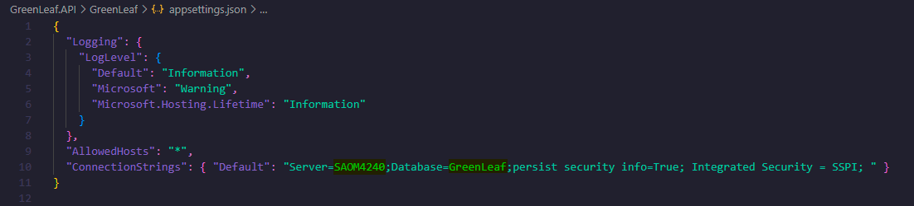

# 🏋️ Master Gym

Aplicativo de academia desenvolvido com [NodeJs](https://nodejs.org/en/) e [React-Native](https://reactnative.dev/).

## 👥 Integrantes
Daniel de Lima Ferreira, RA: 200010 <br>
Enrico Venturini Costa, RA: 210901 <br>
Jhonatan José Gomes do Amaral, RA: 190932 <br>
Pedro Henrique Garcia Silveira, RA: 191046 <br>

## 🚀 Funcionalidades

E-commerce de vegetais.

## 📱 Configurações para rodar o app <br>
### Configurações do app <br><br>
No terminal, utilize o comando **yarn** ou o **npm install** para instalar as dependências do projeto. <br>
### Configurações do banco de dados <br><br>
 <br>
Atribua o hostname da sua máquina à chave "Server".

## ⚙️ Como utilizar

### Iniciando o front-end <br>
Inicie o projeto com o comando abaixo.

```cl
npm start
```
O aplicativo pode ser executado através da leitura do QR Code pelo celular (execução remota) ou da função "Run in web browser" (execução local).

### Iniciando o back-end <br>
Utilize o comando **dotnet run** no terminal para iniciar o back-end.


### Tela de login <br><br>


